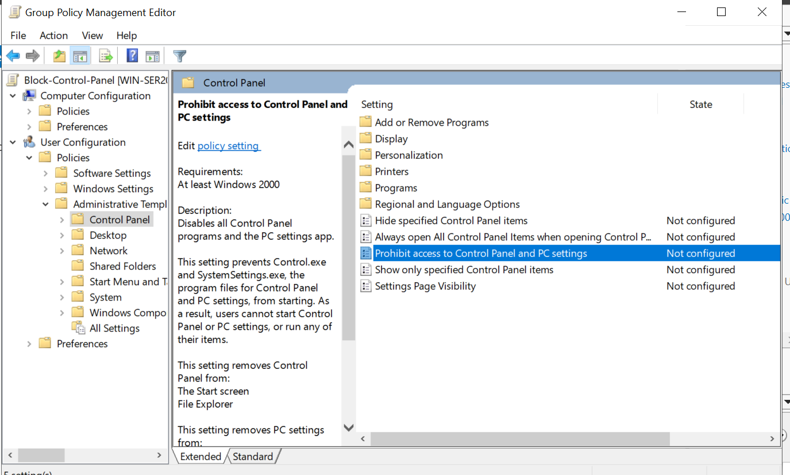
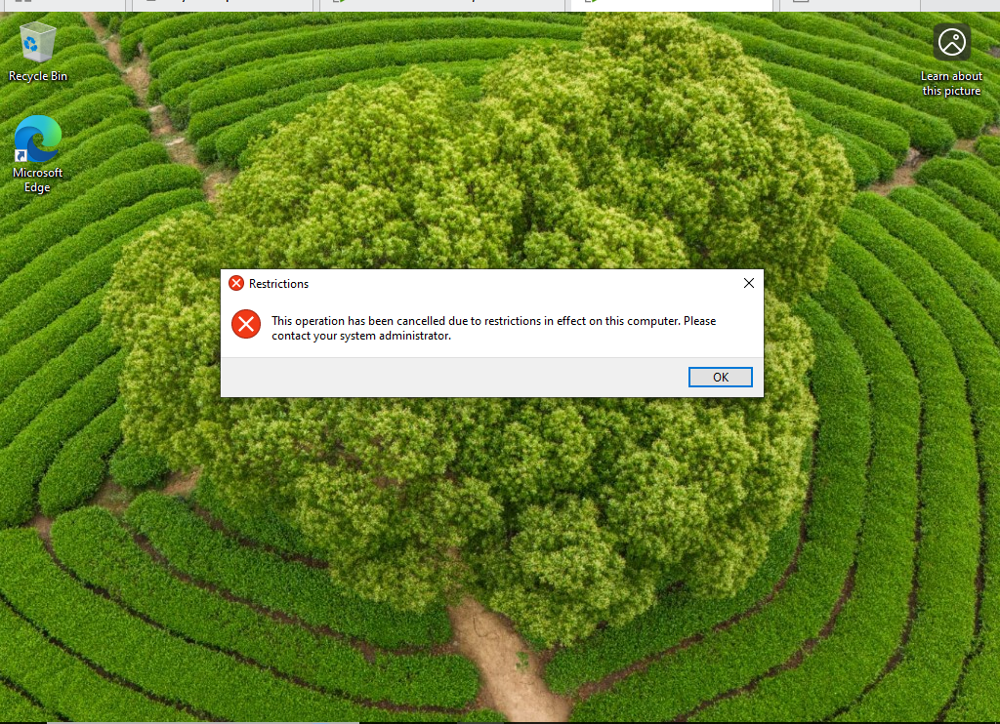

# Active Directory Home Lab: Group Policy Management (GPO)

## Overview

In this lab, I configured and applied a Group Policy Object (GPO) to enforce user restrictions within a domain environment. This simulates a real-world help desk/admin scenario where user access must be controlled across multiple systems.

---

## Objective

The goal of this lab was to:

* Create and configure a Group Policy Object (GPO)
* Apply user-based restrictions
* Link the policy to an Organizational Unit (OU)
* Validate policy enforcement on a domain-joined client machine

---

## Environment

* Windows Server (Domain Controller)
* Windows Client (Domain-joined machine)
* Active Directory Domain: WinServer.local
* Group Policy Management Console (GPMC)

---

## Scenario: Restrict Access to Control Panel

### Problem

Users should not have access to Control Panel or system settings in order to prevent unauthorized system changes.

---

## Step 1: Create a New GPO

A new Group Policy Object was created to manage the restriction.


---

## Step 2: Configure Policy Settings

The following setting was configured:

```
User Configuration → Policies → Administrative Templates → Control Panel
```

Policy:
**Prohibit access to Control Panel and PC settings**



---

## Step 3: Enable the Policy

The policy was set to **Enabled** to enforce the restriction.


---

## Step 4: Link GPO to Organizational Unit

The GPO (`Block-Control-Panel`) was linked to the `Corp-Users` OU to apply the restriction to targeted users.


---

## Step 5: Validation

After applying the policy and running `gpupdate /force`, the restriction was tested on a domain user account.

### Result

The user was unable to access Control Panel, and the following message was displayed:



---

## Key Takeaways

* Learned how to create and manage Group Policy Objects (GPOs)
* Understood how to apply user-based restrictions across a domain
* Gained experience linking GPOs to Organizational Units (OUs)
* Verified policy enforcement through real user testing

---

## Reflection

This lab demonstrated how organizations enforce security and configuration standards using Group Policy. It reinforced the importance of centralized control and how policies can directly impact user behavior and system security.

---

## Skills Demonstrated

* Group Policy Management (GPO)
* Active Directory administration
* User restriction enforcement
* Policy validation and troubleshooting
* Windows Server administration
