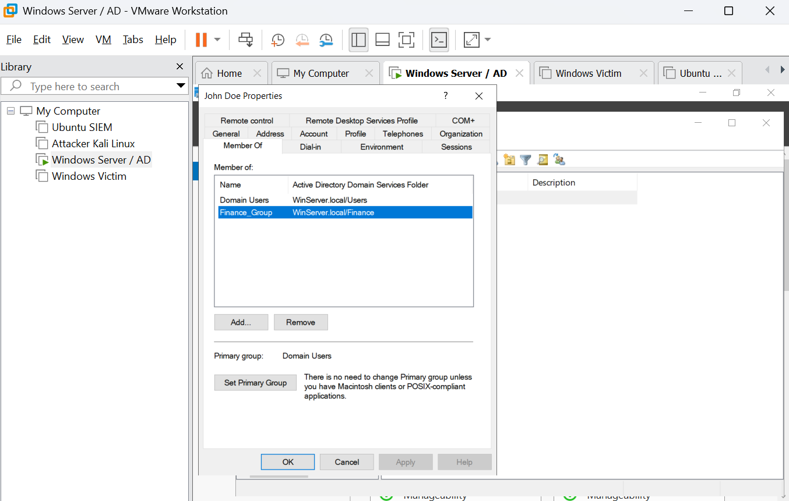

Title

Active Directory Lab: User Access & Group Membership Troubleshooting

Scenario

A user (jdoe) reported they were unable to access finance-related resources.

Environment Setup
Created Organizational Units (Corp-Users, HR, Finance, IT)
Created users across departments
Implemented security groups (Finance_Group, HR_Group, IT_Group)
Assigned users to groups based on department access
Investigation
Verified user account was not locked or disabled 

Reviewed login credentials and domain format
Checked group membership in Active Directory
Identified user was not assigned to the correct department group
Resolution
Added user to the appropriate security group (Finance_Group)

Ensured group membership was applied correctly
Validation
Confirmed user was successfully added to the group
Verified access was restored
Skills Demonstrated
Active Directory user management
Group-based access control
Troubleshooting user access issues
Understanding of authentication vs authorization
